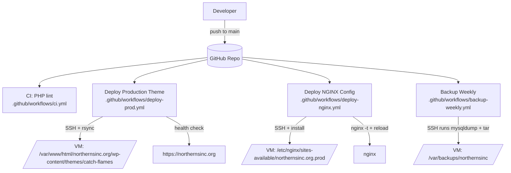

# Northerns Inc Website Ops

This repo is the source of truth for:

- The active WordPress theme code deployed to the VM
- The production NGINX site config deployed to the VM
- GitHub Actions workflows that lint, deploy, and create weekly backups

It intentionally does not track WordPress core, database contents, or media uploads.

## What is tracked

- Active theme: `site/wp-content/themes/catch-flames/`
- NGINX prod config: `infra/nginx/sites-available/northernsinc.org.prod`
- Workflows: `.github/workflows/`
- Runbooks/docs: `docs/`

## Workflow diagram

## GitHub Secrets required

Configured in GitHub Actions secrets:

- `VM_HOST`
- `VM_USER`
- `VM_PORT`
- `VM_SSH_KEY`
- `VM_KNOWN_HOSTS`

## Restore

See `docs/restore.md` for fast recovery steps.
